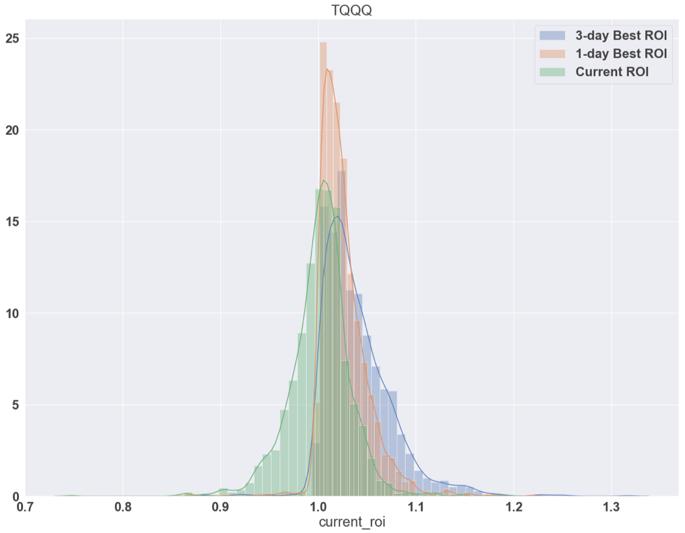
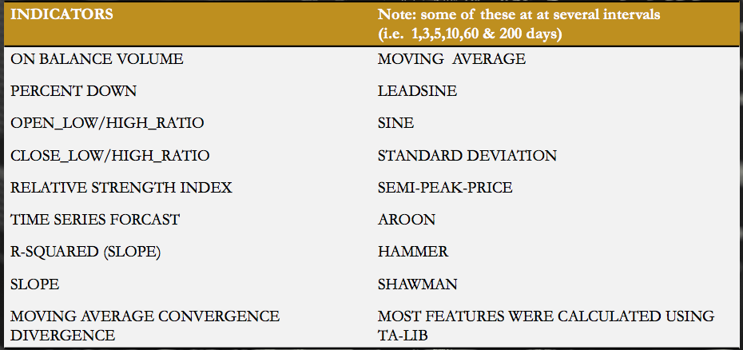
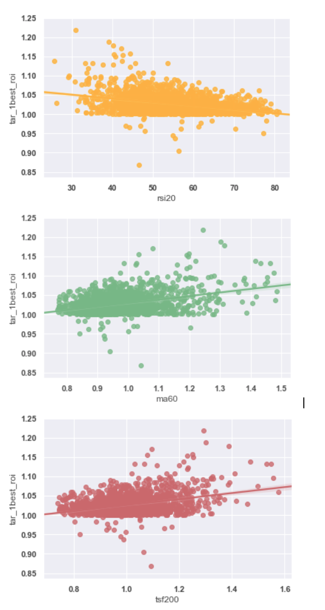
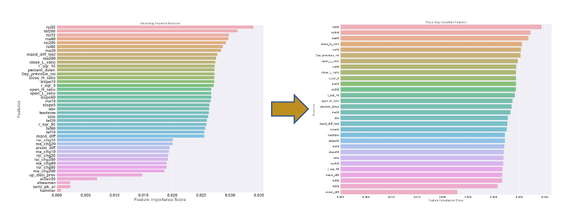
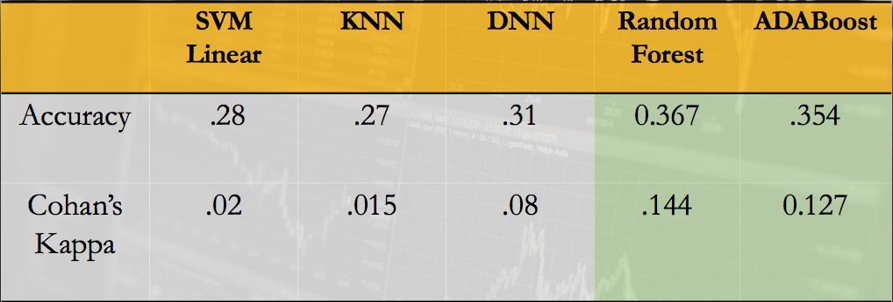
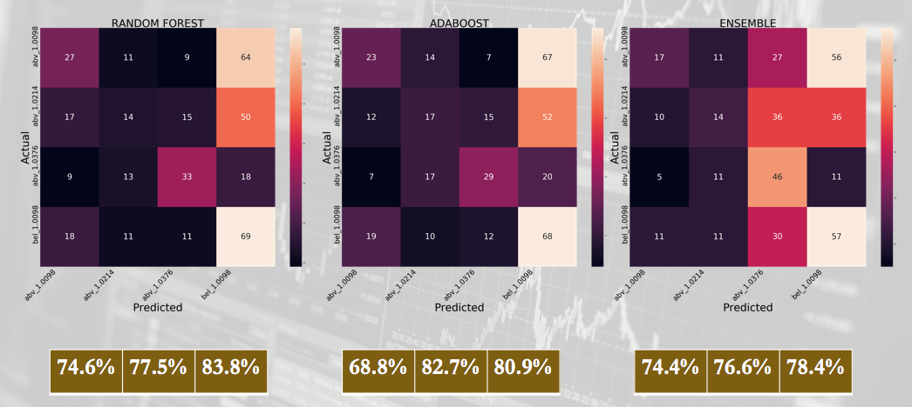
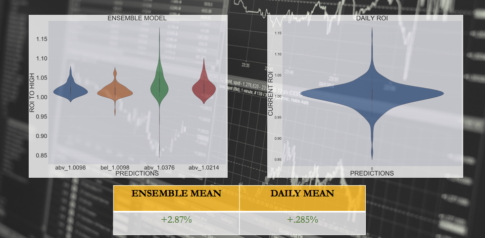

# Stock_classifier

### Problem Statement

 
Is it possible to find non-random patterns in a given stock with significant accuracy in order to time the market better than pure randomness?

#### Introduction

 
Since the beginning of the first publicly traded company in the 1600s to present day Wall Street, investors and speculators alike have been enticed by the notion of growing their wealth beyond the returns of the overall market. This notion is considered contentious among many market economist and analysist. Although, it has been demonstrated that a fraction of investors has beat the overall market through timing and/or fundamental analysis, it is widely accepted that these techniques are not sustainable in the long-term or short-term due to the Efficient Market Hypothesis. This hypothesis states that all important information regarding an asset is already priced in to that stock at any given time. This basically means that no form of technical, or fundamental analysis will give you the edge on buying a stock below fair value. Currently, there are many large financial institutions and hedge funds that invest a lot of their resources on the analysis of stock trends using various machine learning techniques. Most notably, James Harris Simons, a mathematician that has been said to have “cracked Wall Street”, has stated he uses many mathematical techniques to find non-random patterns in the noise of the market through various machine learning techniques and signal analysis. James Simons is currently worth around 20 billion dollars. Although his algorithms are proprietary in nature, we have a lead on the types of techniques he and his colleague’s use.

#### Type of Data Science Learning

 
This project will incorporate several different types of classification models using supervised learning. My project will explore a few models such as random forests, Xgboost, SVMc, KNNs and DNNs to classify optimal days to buy and sell a stock. The techniques used to label my target data will come from looking into the future at various time intervals such as 1 day, 3 day and up to 20 day highs.

#### Why This Approach?

 
As you can see from the distributions below there is far more opportunity to maximize your returns from using the highs on the various days as opposed to only using the open to close or open to open prices as buy and sell opportunities. The one major issue with using the highs instead of the closes, would be that we don't really know when those prices occurred. It is much easier to pin down that price at the beginnning or end of the trading day when using the open to open trading targets. However, if we split our targets into quartiles then we now have a little more information about those prices. That is to say we know generally the probability which those prices occur. For example, everything above quartile 1 (Q1) will likely occur 75 percent of the time. The major assumption we making here is that our training set distributions are similar to our test set distributions. We will explore this assumption in more detail later in our analysis.

  <h3>Compare Distributions </>
  

## Features Engineering

 For this project I used TA-Lib (technical Analysis Library) to create most of my features. Below is chart showing all the features engineered to do my analysis. Notice that for some of these features, I had several different time intervals for them. I did this in order to capture both short and and long term indicators of stocks. This is similar to the techniques used by professional Day Traders on the Market. 

  <h3>Features List </>
  

### Outline

- [x] Introduction
- [ ] Exploratory Data Analysis
- [ ] Feature Selection
- [ ] Model Performance
- [ ] Test vs Train distributions
- [ ] Future Studies
- [ ] Summary

### EDA: Top 3 Predictors
- [x] Exploratory Data Analysis

 Below, you can see the positive and negative relationships between the features and ROI high targets. For the time series forcast (TSF200) we see a strong positive correlation which makes sense if we forcast a stock to increase in value, we should expect it to do so or vice-versa. Next, we have moving average for 60 days (ma60) which takes the moving average and divedes it by the Adjusted Close price of the stock. Thus, when you see a value (x-axis) larger than 1, then you know the price has crossed below the MA line and is "likely" to regress back above it. This is why we see as the MA increases, our ROI also has a tendancy to increase as well. Last, we see the RSI (relative strength index) which is a fundamental momentum indicator for traders to use to indicate whether a stock is over-bought or over-sold. Conventionally, values over 70 are over-bought and values under 30 are over-sold. Hence, the negative relationship. Moreover, we would say that as RSI values increase, we seem to find the stock is over-bought and will 'likely' sell off, and conversly as the RSI decreases we see the stock is over-sold and will 'likely' regress back up with more buying volume. 

  <h3>Top 3 Predictors vs High ROI (Return on Investment) </>
  

#### Decreasing our Feature Space 
- [x] Feature Selection

 Decreasing our feature space is important because as you add more and more features it becomes more and more difficult to find local minimum and maximum in that increasing dimensional space. Thus, it best to use some kind of process to reduce the number of features. You can use various techniques such as PCA (principle component analysis), pearson correlation, random forests and several others. I choose random forests. The only issue with using random forest's feature selection is that it has a bias toward high frequency features. This means I could have some indicators which are sparse but predict well when they do occur. However, since they don't occur often random forests weigh them less than other features. As you can see below, I went from 43 features down to 29 features. I choose these features because as I started to take more features off, I tended to decrease my accuracy.

  <h3>Feature Selection </>
  

#### Testing Our Models
- [x] Model Performance

  <h3>Model Performance </>
  

#### Metrics
    
 From the above chart we can see how well each of our models did. Accuracy here is showing how well it predicted the exact class or quartile range. Alternatively, Cohen's Kappa ranges from -1 to 1 and indicates better than random chances above 1 and worse than random guessing less than 1. In all cases, we did better than random guessing. However, when I built my Ensemble model, I choose to only take in the models from Random Forests and AdaBoost since they were the best predictors. Also, as I will discuss later, I will only be concerned with how well each one predicts the liklihood of being above Q1. I do this because it has higher probabilities when doing it in this manner. 

#### Confusion Matrix of Models

 Below shows the confusion matrices for my models. notice a few things about the predictions. First, understanding how I personally calculated my accuracy is important. Using each column as my predictor, I counted all classifications actually valued above Q1 to be accurate and ones that were actually below Q1 to be inaccurate. I did this in part because we can use these percentages as likelihoods of being correct at knowing the minimal high for that given day. Additionally, we can use that information to make informed decisons on holding out for higher gains on certain days to reap larger returns. Second, the ensemble model that I used didn't do any better than my component models. The ensemble was build using the probabilities of each target from the first two models along with the top 4 predictive features. This resulted in the ensemble to being averaged down for an overall accuracy. lastly, in future work I would ensemble using voting; taking in only the best predictor columns form each model. Also, with these predictors from various models, I could optimally buy the highest probability stocks on given days to maximize returns.

  <h3>Confusion Matrices </>
  

#### More Results

 Below we are looking at the distributions of my model predictions vs open to open price ROI. Notice that the model's predictions have a much higher expected value (mean) than the buy and hold over time. This can be misleading, however, it still shows us that we have a higher likelihood to capitalize using these models than random guesing of buying and selling each day. The percentages are showing the average percentage gain from wach distribution. This information could be useful for a Day Trader to understand their liklihood of returns for that day decent prices to put stop limits on their stock. Stop limits are prices at which a trader chooses to buy or sell an equity once the price of that equity reaches that limit. 

  <h3>More Distributions </>
  

## Conclusion
- [x] Conclusion: What I learned.

 After doing many experiments I was able to learn a few things about this problem. First, epsilon in this case is the probability that were explore the bandits that look to have a smaller sample mean. Thus, we call this the epsilon-greedy problem. Alternativly, one minus epsilon equals the probability that the agent will eploit the perceived largest sample mean. Next, I noticed higher eploration of all the bandits produces lower variance of mean estimates. Consequently, there are two ways to collect larger samples of all the bandits. One is by increasing your epsilon values and two is by increasing the number of iterations you play with the bandits. The downside to increasing epsilon too much was it would never converge on the highest bandit. The downside to larger iterations of play is it may be costly in real-life practice. Thus, the optimal range for epsilon was from .01 to .1. Although, it seemed reasonable to use a psuedo-decay epsilon to maximize effectiveness of minimizing variance of sample means and maximizing the highest returns. I am still working on the last problem, but see code for more info related to this problem.  

